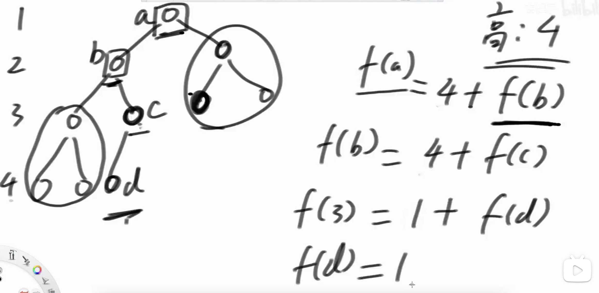

# 1.二叉树的层序遍历（按层收集节点）
https://leetcode.cn/problems/binary-tree-level-order-traversal/description/

1. 用队列, 节点出去之后把子节点加入
2. 一次处理一层，用size来记录这层有几个节点

# 2.二叉树的锯齿形层序遍历
https://leetcode.cn/problems/binary-tree-zigzag-level-order-traversal/

1. 这个跟上面一题的区别是，我们每层收集的时候，有两种顺序，从左到右和从右到左，可以用一个标志reverse来记录
2. 先根据顺序收集，再遍历该层节点，推入下一层。


# 3.二叉树的最大宽度
https://leetcode.cn/problems/maximum-width-of-binary-tree/description/

1. 利用每层最右节点id - 最左节点id + 1 可求出当前层最大宽度
2. 一次处理一层数据，找到该层最大宽度
3. 计算id时候，注意防止溢出

# 4.求二叉树最大深度
https://leetcode.cn/problems/maximum-depth-of-binary-tree/description/

1. 递归去求

# 5.二叉树最小深度
https://leetcode.cn/problems/minimum-depth-of-binary-tree/description/

1. 深度指的是到叶子节点
2. 注意递归的调用，左孩子或右孩子非空，再去调函数

# 6.二叉树的序列化与反序列化（递归）
https://leetcode.cn/problems/serialize-and-deserialize-binary-tree/

1. 先序，都是递归
2. 空节点也要用符号‘#’标识

# 7.二叉树的序列化与反序列化（层序）
https://leetcode.cn/problems/serialize-and-deserialize-binary-tree/

1. 按层序列化
2. 空位置需要占位
3. 反序列化的时候，出队一次性解决左右孩子
4. 左右孩子存在，就再入队

# 8.从前序与中序遍历序列构造二叉树
https://leetcode.cn/problems/construct-binary-tree-from-preorder-and-inorder-traversal/

1. 先序可以确定根节点
2. 中序可以确定左右子树
3. 用map存储中序里节点的索引
```javascript
// pre : l1(........)[.......r1]
// in  : (l2......)k[........r2]
// (...)是左树对应，[...]是右树的对应
head.left = f(pre, l1 + 1, l1 + k - l2, in, l2, k - 1, map);
head.right = f(pre, l1 + k - l2 + 1, r1, in, k + 1, r2, map);
```

# 9.二叉树的完全性检验
https://leetcode.cn/problems/check-completeness-of-a-binary-tree/description/

1. 层序遍历
2. 如果有右孩子但是没有左孩子，就不是
3. 如果一个节点孩子不全(有左或者没有孩子)，之后的节点必须都是叶子节点，否则不是。

# 10.求完全二叉树节点个数
https://leetcode.cn/problems/count-complete-tree-nodes/



1. 我们的公式只能求满二叉树，所以对满二叉树部分用公式，对另一部分用递归

2. 右树最左节点可以扎到最底部 => 左树是满二叉树
```
左树 + 该节点 = 2^0 + 2^1 +...+ 2^(h - level - 1) + 1 = 2^(h - level) - 1 + 1 = 2^(h - level)
```

2. 否则右树是满二叉树，高度比左边少1
```
右树 + 该节点 = 2^0 + 2^1 +...+ 2^(h - level - 2) + 1 =  2^(h - level - 1) - 1 + 1 = 2^(h - level - 1)
```
  

   

 